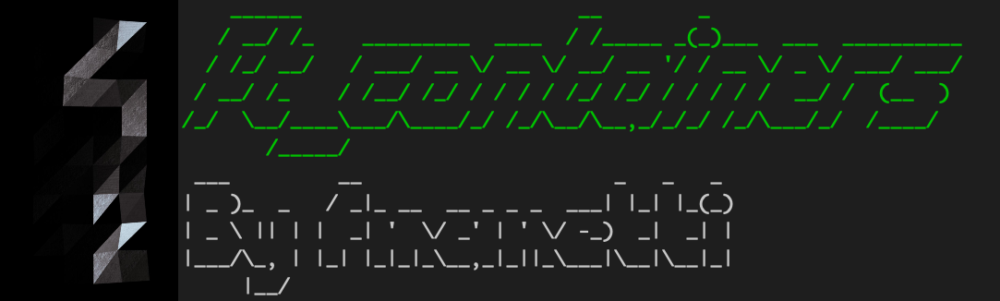

# ft_containers ✅

- 42cursus - 2021 - Version 3
- Author = fmanetti
- Result = 100%
- Closed = 04 / 11 / 2021

## Description

The multiple available containers in C++ all have very different usage. To
make sure you understand them, let’s re-implement them!

## Skills
* Rigor
* Object-oriented programming

## Introduction

In this project, you will implement the various container types of the C++ standard
template library.
For each container, turn in the appropriately named class files.
The namespace will always be ft and your containers will be tested using ft::<container>.
You need to respect the structure of the reference container. If it’s missing a part of the
orthodox canonical form, do not implement it.
As a reminder, we are coding in C++98, so any new feature of the containers MUST NOT
be implemented, but every old feature (even deprecated) is expected.

## Vector

- [x] constructor
- [x] destructor
- [x] operators

- [ ] Iterators
    - [x] begin
    - [x] end
    - [x] rbegin
    - [x] rend

- [ ] Capacity
    - [x] size
    - [x] max_size 
    - [x] resize
    - [x] capacity 
    - [x] empty
    - [x] reserve

- [ ] Element access
    - [x] operator[]
    - [x] at
    - [x] front
    - [x] back

- [ ] Modifiers
    - [x] assign
    - [x] push_back
    - [x] pop_back
    - [x] insert
    - [x] erase
    - [x] swap
    - [x] clear

- [ ] Allocator
    - [x] get_allocator

- [ ] Non-member function overloads
    - [x] relational operators
    - [x] swap

## Map

- [x] constructor
- [x] destructor
- [x] operator=

- [ ] Iterators
    - [x] begin
    - [x] end
    - [x] rbegin
    - [x] rend

- [ ] Capacity
    - [x] empty
    - [x] max_size 
    - [x] size

- [ ] Element access
    - [x] operator[]

- [ ] Modifiers
    - [x] insert
    - [x] erase
    - [x] swap
    - [x] clear

- [ ] Observers
    - [x] key_comp
    - [x] value_comp

- [ ] Operations
    - [x] find
    - [x] count
    - [x] lower_bound
    - [x] upper_bound
    - [x] equal_range

- [ ] Allocator
    - [x] get_allocator

## Stack

- [ ] Member function
    - [x] constructor
    - [x] size
    - [x] empty
    - [x] top
    - [x] push
    - [x] pop

- [ ] Non-member function overloads
    - [x] relational operators
    - [x] swap

## Sources

* [cplusplus.com](https://www.cplusplus.com/)
* [cppreference.com](https://en.cppreference.com/w/)
* [Iterators Traits](https://www.codeproject.com/Articles/36530/An-Introduction-to-Iterator-Traits)
* [std::iterator](https://www.fluentcpp.com/2018/05/08/std-iterator-deprecated/)
